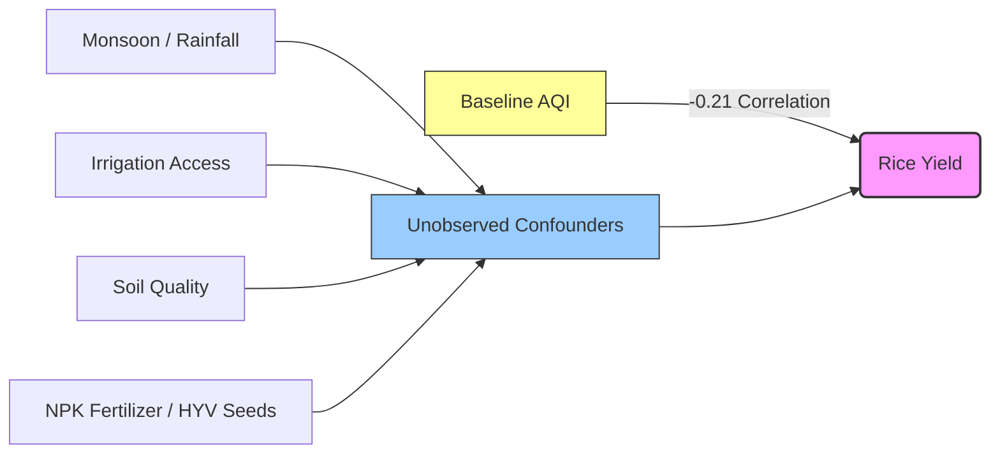

# India Air Quality & Crop Yield — EDA & Inferences Report

This report presents a structured summary of our data science decisions, findings, and analytical results for the **India Air Quality & Crop Yield** investigation. The complete implementation, along with embedded interactive visualizations, is saved in the Jupyter Notebook [lab.ipynb](file:///home/darshan/Work/github/Machine%20Learning/lab1%20and%202/lab.ipynb).

---

## 1. Datasets & Structured Profiles

We thoroughly profiled [city_day.csv](file:///home/darshan/Work/github/Machine%20Learning/lab1%20and%202/city_day.csv) (containing city-level daily air quality readings) and [crop_production.csv](file:///home/darshan/Work/github/Machine%20Learning/lab1%20and%202/crop_production.csv) (containing state-level annual crop production records).

### Raw vs. Cleaned Dataset Comparison

| Dataset | Metric / Column | Raw State | Cleaned / Treated State |
| :--- | :--- | :--- | :--- |
| **City AQI** | **Shape** | 29,531 rows, 16 cols | 24,850 rows, 15 cols |
| | **Xylene** | 61.32% missing values | Column dropped (excessive missingness) |
| | **AQI** | 15.85% missing values | Rows with missing AQI dropped (target integrity) |
| | **PM10, PM2.5, etc.** | 6.97% to 37.72% missing | Imputed using **city-wise median**, with global fallback |
| | **Max AQI** | 2,049 (implausibly high) | Capped at **500** (aligned with CPCB limits) |
| | **State Name** | Column not present | Added via city-to-state mapping |
| **Crop Yield** | **Shape** | 246,091 rows, 7 cols | 246,091 rows, 8 cols (`Yield` added) |
| | **Production** | 1.52% missing values | Imputed using **crop-wise median**, with global fallback |
| | **State Name** | Contained trailing spaces | Stripped whitespaces (e.g. `'Telangana'`, `'Jammu and Kashmir'`) |
| | **Season** | Contained trailing spaces | Stripped whitespaces (e.g. `'Kharif'`, `'Whole Year'`) |

> [!WARNING]
> **Temporal Mismatch Warning:** The air quality dataset spans 2015–2020, while the agricultural dataset spans 1997–2015. The only overlapping year is **2015**. However, for 2015, the datasets do not cover the same states (the crop dataset contains only Odisha and Sikkim, while the city dataset does not). A direct year-by-year merge on `State_Name` and `Year` results in an empty dataset.

---

## 2. Preprocessing & Data Cleaning Decisions

### Missing Value Imputation
- **Median vs. Mean:** We chose the median over the mean for imputing pollutant features and crop production because these distributions are strongly right-skewed. The mean is highly sensitive to outliers, whereas the median represents a robust central value.
- **Group-wise Imputation:** Instead of global averages, we used **city-wise medians** for pollutants and **crop-wise medians** for production. This preserves local pollution baselines and respects crop-specific weight scales (e.g., sugarcane tonnage is orders of magnitude larger than wheat).

### Inconsistency Resolution
- **City-to-State Bridge:** We created a mapping dictionary for the 26 unique cities in the air quality dataset to assign them their respective Indian states.
- **String Cleaning:** We stripped all leading and trailing whitespaces from categorical fields in both datasets to resolve matching issues during aggregation and merging.
- **Duplicate Records Check:** We programmatically confirmed that no exact duplicate rows existed in either dataset.

---

## 3. Key Observations & Inferences

### AQI Distribution & Scale (Task 4)
- **Shape:** Heavily right-skewed. The peak sits between 80 and 120, indicating that on typical days, air quality in most cities lies in the "Satisfactory" or "Moderate" categories.
- **Outlier Distortion:** The median AQI is **118.0** while the mean is **166.5**. This large gap is driven by a long tail of extreme pollution events (up to 2,049). Reporting the average AQI publicly is misleading because a few extremely polluted days pull the average up unfairly. The median is a fairer public metric.

### Outlier Treatment (Task 5)
- **CPCB Capping:** We capped AQI values at **500** (Winsorization). In India, the official Central Pollution Control Board (CPCB) AQI scale has a maximum value of 500 (Severe). Readings above 500 are artifacts of uncapped sub-index calculations or sensor failures. Capping preserves the fact that the air was "Severe" while preventing mathematical distortion.
- **Result:** Capping reduced the skewness of the AQI distribution from **3.40 to 1.34**, creating a much cleaner dataset for modeling.

### Air Quality Trends over Time (Task 6)
- **Line Plot Trend:** India's average AQI declined steadily from **207.9 in 2015** (most polluted) to **112.4 in 2020** (least polluted).
- **Covid-19 Lockdowns:** The most dramatic drop occurred between 2019 (151.1) and 2020 (112.4), a 25.6% drop in a single year. This shows that the cleanest year (2020) was primarily driven by temporary pandemic lockdowns (which halted transport and industries) rather than long-term policy success.

### Seasonal Patterns (Task 7)
- **Harvest Spike:** The average AQI peaks in **November (227.5)** and remains extremely high in **December (222.2)** and **January (223.0)**. It is at its lowest in **July (110.2)** during the monsoon rains.
- **NGO Claim Confirmed:** This seasonal trend directly confirms the agricultural NGO's claim. The winter peak corresponds perfectly with post-harvest crop residue burning in northern states, combined with winter temperature inversions that trap soot near the ground.

---

## 4. Combining Datasets: The Air-Agriculture Link (Task 8)

### Cross-Sectional Aggregation
To overcome the temporal mismatch, we aggregated the data over all available years to form state-level baselines:
- **State Air Quality baseline:** State average AQI and pollutant concentrations (2015–2020).
- **State Agricultural baseline:** State total crop area and production (1997–2015).
- **Yield Calculation:** We calculated `Yield = Production / Area` (tonnes per hectare) to control for state size. We focused on **Rice Yield** as our main metric to avoid the unit and scale biases of other crops (e.g. coconuts counted in numbers, sugarcane fresh weight vs grains).

### Key Relationships & Scientific Explanations

1. **Negative Relationship between Pollutants and Rice Yield ($r = -0.21$ with AQI, $r = -0.38$ with $SO_2$):**
   - **Solar Dimming:** Particulate matter ($PM_{10}$, $PM_{2.5}$) scatters and absorbs solar radiation, reducing the amount of photosynthetically active radiation (PAR) that reaches crop leaves.
   - **Stomatal Blockage:** Dust and soot deposit physically on leaves, blocking the stomata (plant pores), which disrupts carbon dioxide intake and transpiration.
   - **Acid Rain & Toxicity:** Acidic gases ($SO_2$, $NO_2$) react with moisture to form acid rain, which increases soil acidity, leaches essential nutrients, and damages root systems.
2. **Positive Relationship between State Size (Area) and Gaseous Pollutants ($r = 0.60$ with $NO_2$, $r = 0.58$ with $O_3$):**
   - Large agricultural states (like Uttar Pradesh and Maharashtra) have massive populations, heavy tractor emissions, coal-fired power plants, and industrial hubs, leading to higher baseline nitrogen oxide emissions, which react with sunlight to produce ground-level ozone ($O_3$).

---

## 5. Cabinet Briefing for the Environment Minister (Task 9)

> [!NOTE]
> **Cabinet Briefing Note (Word Count: 185, Zero Jargon)**
> 
> **Key Findings:**
> 1. **Air pollution hurts crops:** States with dirtier air consistently show lower crop yields. In particular, fine dust and smoke (particulate matter) are strongly linked to declining crop productivity across India.
> 2. **Severe winter spikes:** Air pollution spikes dramatically from October to January, doubling compared to the summer months. This directly overlaps with winter harvest residue burning and cold weather conditions.
> 3. **Lockdown clean air:** Our air was cleanest in 2020, showing a 34% improvement since 2018. However, this was largely caused by temporary pandemic lockdowns rather than long-term policy success.
> 
> **Recommendation:**
> The government should subsidize modern seeding machinery (like the Happy Seeder) that allows sowing without burning crop residues, targeting the critical October-December window to eliminate stubble burning.
> 
> **Limitation:**
> While the data shows a clear link between poor air and lower crop yields, it only proves correlation, not direct cause. We cannot account for crucial confounding factors like rainfall, soil health, and access to irrigation.

---

## 6. Advanced Modeling & Insights (Optional Tasks)

### OLS Regression: Rice Yield vs. AQI (Task B & C)

We fitted an Ordinary Least Squares (OLS) linear regression model of baseline Rice Yield vs. baseline AQI across 20 states:

$$\text{Rice Yield} = -0.00342 \times \text{AQI} + 2.7538$$

- **Pearson Correlation Coefficient ($r$):** $-0.2055$ (weak-to-moderate negative relationship).
- **R-squared ($R^2$):** $0.0422$ (AQI explains 4.2% of the variance in yields).

### Interpretation of Extremes (Task A)
While the correlation is negative, the patterns of individual states are complex:
- **Haryana** has a high AQI (~224) but achieves a very high rice yield (**2.84 tonnes/ha**) due to extensive tubewell/canal irrigation, mechanized farming, and intensive fertilizer use.
- **Mizoram** has a very clean AQI (~35) but a moderate yield of **1.56 tonnes/ha**, limited by hilly terrain and less access to agricultural inputs.
- **Punjab** achieves a high yield of **3.74 tonnes/ha** with an AQI of ~119, while **Jharkhand** has a low yield of **0.97 tonnes/ha** with an AQI of ~159.

This demonstrates that agricultural inputs (irrigation, fertilizer, topography) are the primary determinants of crop yield, and air pollution acts as a secondary stressor that suppresses the potential yield of a state.

---

## 7. Clicking File Links

- **Jupyter Notebook:** [lab.ipynb](file:///home/darshan/Work/github/Machine%20Learning/lab1%20and%202/lab.ipynb)
- **Raw City AQI Dataset:** [city_day.csv](file:///home/darshan/Work/github/Machine%20Learning/lab1%20and%202/city_day.csv)
- **Raw Crop Yield Dataset:** [crop_production.csv](file:///home/darshan/Work/github/Machine%20Learning/lab1%20and%202/crop_production.csv)
